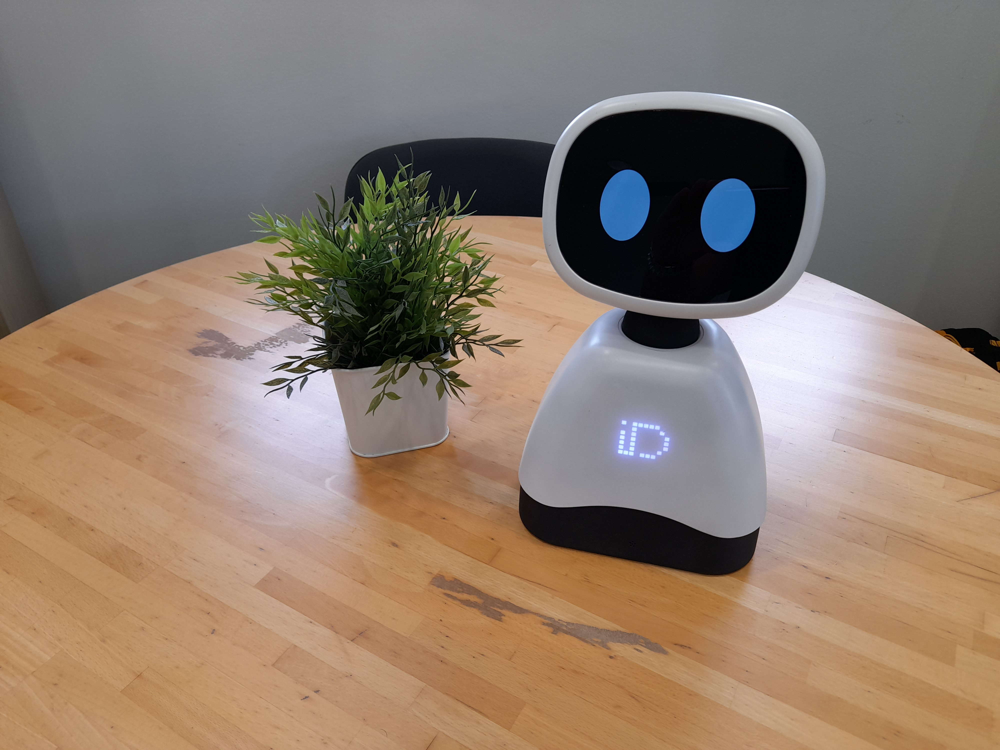

# TAGI

Develop applications for IDMind's tabletop robot TAGI.

This repository contains the source code installed on the robot. There are significant changes from this version to the first. Read on to know more.

TAGI runs on a Raspberry PI 5, running Raspberry PI OS Bullseye and is developed using Python >=3.9.

Although there is a REST API that allows for some low level control, users are advised to also use Python 3 for application development.

We believe TAGI has the necessary hardware to allow for engaging interactions with people in several domains, including Edutainment, HRI research and commercial applications.