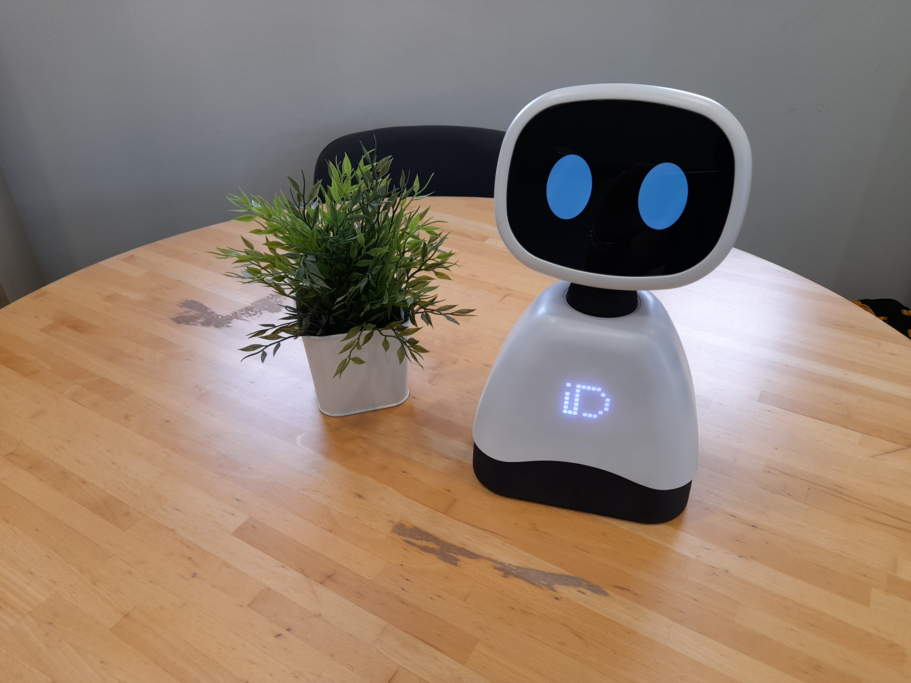

# Elmo V2





Develop applications for IDMind's tabletop robot Elmo.

This repository contains the source code installed on the robot. There are significant changes from this version to the first. Read on to know more.

Elmo runs on a Raspberry PI 4, running Raspberry PI OS Bullseye and is developed almost exclusively using Python 3.9.

Although there is a REST API that allows for some low level control, users are advised to also use Python 3 for application development.

We believe Elmo has the necessary hardware to allow for engaging interactions with people in several domains, including Edutainment, HRI research and commercial applications.

## Hardware

- Power Button
- Ethernet Port
- Microphone
- 13x13 Led Matrix
- Capacitive touch sensors (1 in chest, 4 in head)
- 2 servo motors for head movement (pan and tilt)
- Touchscreen (face)
- RGB Camera
- Battery

## First usage

After receiving Elmo, place the robot on a steady surface and hold the power button for 3 seconds. The green power LED should light up as soon as the button is pressed and stay lit after the user releases it. If the LED does not light up, then the robot is out of battery and the provided power supply should be plugged in. If the LED lights up but does not stay lit, then the button needs to be held for a bit more time. Wait for the robot to finish booting.

After the robot finishes the boot process, the IDMind logo should show on the LED matrix, the head will start movement and the robot's eyes will appear.

The user can also test the capacitive touch sensors by petting the robot on the head.

To shutdown the robot, hold the power button for 3 seconds.

By plugging an Ethernet cable to the robot, you will be able to access the robot remotely, using the companion app.

## Companion App

In this repository, under `app/` is the source code for Elmo's companion app. The app was developed using PyQT5 and QTDesigner, under Ubuntu 18.04. You can run the app using the `app/dev.sh` script, or build the application using `app/build.sh`. Resolve dependencies as they appear, using pip.

Alternatively, you can request a prebuilt version by email.

The Companion App will attempt to discover any Elmos on the network using UDP broadcast. After finding your Elmo, you can click the button to connect to it and use the application to explore and test different functionalities of the robot. 

Also, take note of the robot's IP, since you will probably want to SSH into it for development, at some time.

The App communicates with Elmo via a REST API, which is also a decent way to control the robot.

## REST API

The REST API is served by the robot via http at port 8001. Below is a description of the available methods.

---

[GET] http://<robot_ip>:8001/status 
 - Query the robot's status

 Body: 
 
    {

    }

 Example reply:

    {
        "battery": 15.9016345,
        "behaviour_blush": false,
        "behaviour_look_around": true,
        "icon_list": [
            "call.png",
            "heartbeat.gif",
            "elmo_idm.png",
            "music.png"
        ],
        "image_list": [
            "thinking.png",
            "love.png",
            "normal.png",
            "cute_elmo.jpg",
            "background_black.png",
            "tears.png"
        ],
        "microphone_is_recording": false,
        "multimedia_port": 8000,
        "pan": -32.87461773700305,
        "pan_max": 40,
        "pan_min": -40,
        "pan_temperature": 168,
        "pan_torque": true,
        "recognized_speech": "do you like Alexa",
        "sound_list": [
            "mic.wav",
            "correct.wav",
            "love.wav"
        ],
        "tilt": -7.186544342507659,
        "tilt_max": 15,
        "tilt_min": -15,
        "tilt_temperature": 169,
        "tilt_torque": true,
        "touch_chest": false,
        "touch_head_e": false,
        "touch_head_n": false,
        "touch_head_s": false,
        "touch_head_w": false,
        "video_list": [
            "eyes_green_all.mp4"
        ],
        "volume": 18
    }


---

[POST] http://<robot_ip>:8001/command 
 - Send a command to the robot

Body: 
 
    {
        "op": <operation>
        "<param1>": <value1> 
    }

Reply:

    {
        "success": <true or false>,
        "message": <OK or error description>
    }


You choose the operation by passing the appropriate value for `op` and any additional parameters required.

As an example, to disable the `blush` behaviour, which is the robot's reaction to pets, we would send the following body to the `/command` endpoint:

    {
        "op": "enable_behaviour",
        "name": "blush",
        "control": false
    }


The full list of available operations is the following:

---
- enable_behaviour

Description: control behaviours

Expected params:

    - <string> name
    - <bool> control

---
- set_pan_torque

Description: control pan torque

Expected params:

    - <bool> control

---
- set_pan

Description: control pan angle

Expected params:

    - <float> angle

---
- set_tilt_torque

Description: control tilt torque

Expected params:

    - <bool> control

---
- set_tilt

Description: control tilt angle

Expected params:

    - <float> angle

---
- play_sound

Description: play a sound from the robot's internal multimedia server

Expected params:

    - <string> name

---
- pause_audio

Description: Pause sound playback

Expected params:

---
- set_volume

Description: control volume

Expected params:

    - <int> volume (0 ~ 100)

---
- start_recording

Description: start recording audio. recording will be saved as mic.wav

Expected params:

---
- stop_recording

Description: stop recording audio

Expected params:

---
- set_screen

Description: update screen. Use this to set an image, play a video, show text, or load a website. send an empty object to clear.

Expected params:

    - <string> image (optional)
    - <string> video (optional)
    - <string> text (optional)
    - <string> url (optional)

---
- update_leds

Description: update led matrix. send a list of 13x13=169 colors. each color is a list of 3 (rgb components). row major ordering.

Expected params:

    - <list> colors

---
- update_leds_icon

Description: load an icon to the led matrix using the robot's internal media server

Expected params:

    - <string> name

---
- reboot

Description: reboot PC

Expected params:

---
- shutdown

Description: shutdown robot

Expected params:


## Python API

The REST Api will only get you so far, eventually you may need to program new behaviours or drivers using the python sdk.

The previous version of Elmo used ROS (Robot Operating System) as a middleware to exchange messages between different processes, as well as managing bringup and configuration.

This version, however, uses a custom middleware, built on Redis (https://redis.io/).

All drivers and behaviours use the classes defined in the module `src/middleware.py` to broadcast their state, exchange messages and load configuration parameters.

The module `src/robot_api.py`, which exposes the REST Api used by the companion app is an excellent way to study how to implement new applications using the middleware library, since it accesses all low level capabilities of the robot.

The behaviour modules can also serve as good examples.

## Using the middleware library

Most often you will be using the middleware library to access robot capabilities.

You can do so using the several classes defined which extend the DBEntry class.

Each of these classes defines a *fields* dictionary. The keys in this dictionary can be used as properties of the instance. Reading these properties or changing them will translate to a request to the underlying REDIS database. 

For example, the module `src/driver_speakers.py` will update the *playing* field of it's instance of ***middleware.Speakers***. If you would like to know if sound is being played by the robot, you would run the following code:

```python

import middleware as mw
speakers = mw.Speakers()
is_playing = speakers.playing

```

Conversely you could also update the *playing* field, if you wanted to develop new speaker drivers for instance.

Some classes also expose methods to expand the logic without affecting the database. For example the Leds class has a ***load_from_url*** method, which will calculate the colors for the leds based on the loaded icon. The module `src/behaviour_change_mode.py`, which changes the led icon when the power button is pressed, has code similar to the following.

```python

import middleware as mw
leds = mw.Leds()
server = mw.Server()
url = server.url_for_icon("music.png")
leds.load_from_url(url)

```

In the middleware library, there are classes that implement tools that allow other programs to signal themselves as **nodes**, allowing users (or other nodes) to monitor and control the state of the system.

## Using the middleware as a command line tool

By calling **middleware** from the command line you can monitor several aspects of the running nodes.

```$ middleware```

```usage: python3 middleware.py <list|killall|shutdown|force_shutdown|state|monitor|reset>```


- list -> list running nodes
- killall -> gracefully shutdown all running nodes
- shutdown -> gracefully shutdown a node
- force_shutdown -> forcefully shutdown a node
- state -> get a snapshot of the REDIS database. Pass additional arguments to filter by prefix
- monitor -> get periodic snapshots of the REDIS database
- reset -> clear the database

## Scripts

The bringup scripts are located inside the `scripts/folder`. A cronjob will launch them, edit by running the following command:

```$ crontab -e```
